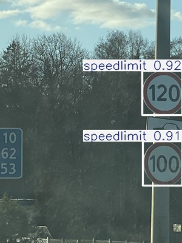
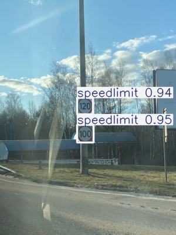

# 🚦 Road Sign Detection with YOLOv8

도로 표지판 이미지를 대상으로 **YOLOv8**을 활용해 객체 탐지(Object Detection)를 수행한 프로젝트입니다.
PASCAL VOC(XML) 형식의 어노테이션 데이터를 **YOLO 형식**으로 변환하고,
Ultralytics YOLOv8 프레임워크를 사용해 **학습 및 추론 전체 파이프라인**을 구축했습니다.

---

## 📌 Project Overview

* 도로 표지판 이미지 객체 탐지
* **VOC → YOLO 라벨 변환 파이프라인** 구축
* 데이터 구조 정리 및 학습 오류 해결 경험
* **Google Colab 환경**에서 YOLOv8 학습 수행

---

## 🛠 Environment

* **Python** 3.12
* **PyTorch**
* **Ultralytics YOLOv8**
* **Google Colab**
* **CUDA** (Tesla T4)

---

## 📂 Dataset Structure

### 📄 data.yaml 예시

```yaml
path: /content

train: train/images
val: val/images
test: test/images

nc: 4
names: ['trafficlight', 'stop', 'speedlimit', 'crosswalk']
```

* `path` : 데이터셋 최상위 경로
* `train / val / test` : 이미지 폴더 경로
* `nc` : 클래스 개수
* `names` : 클래스 이름 목록

➡️ YOLOv8 학습 시 **데이터 경로와 클래스 정보를 연결하는 핵심 설정 파일**

---

```
road_sign_datasets/
├── images/
│   ├── train/
│   ├── val/
│   └── test/
│
├── labels/
│   ├── train/
│   ├── val/
│   └── test/
│
└── data.yaml
```

* `images/` : 이미지 파일 (`.png`)
* `labels/` : YOLO 형식 라벨 파일 (`.txt`)
* `data.yaml` : 데이터 경로 및 클래스 정보 관리

---

## 🏷 Annotation Format

### Original Format (PASCAL VOC)

* XML 기반 어노테이션
* Bounding Box 정보

  * `xmin`, `ymin`, `xmax`, `ymax`

### Converted Format (YOLO)

```
class_id x_center y_center width height
```

* 모든 좌표 값은 **0 ~ 1 사이로 정규화**
* 이미지 크기 기준으로 변환됨

---

## 🧹 Data Preprocessing

* 잘못된 라벨(`None` 값 포함) 제거
* **빈 라벨 파일 자동 삭제**
* 이미지와 라벨 파일 **이름 일치 여부 검증**
* `train / val / test` 구조 재정렬

➡️ 데이터 전처리 단계에서의 검증이 학습 안정성에 매우 중요함을 확인

---

## 🚀 Training

YOLOv8 **사전학습 모델**을 기반으로 학습을 진행했습니다.

```python
from ultralytics import YOLO

model = YOLO("yolov8s.pt")

model.train(
    data="/content/road_sign_datasets/data.yaml",
    epochs=10,
    imgsz=640,
    batch=32
)
```

---

## ⚠️ Common Issues & Fixes

### ❌ No labels found 경고

**원인**

* 라벨 파일이 비어 있음
* YOLO 형식이 아닌 라벨 사용

**해결**

* XML → YOLO 변환 로직 재확인
* 라벨 파일 생성 여부 검증

---

### ❌ could not convert string to float: 'None'

**원인**

* XML 어노테이션에 `None` 값 존재

**해결**

* XML 파싱 단계에서 **유효하지 않은 bbox 필터링**

---

## 🔍 Inference (Test)

```python
model = YOLO("runs/detect/custom_s2/weights/best.pt")
results = model.predict(source="/content/road_sign_datasets/images/test")
```

* 결과 이미지는 `runs/detect/` 경로에 자동 저장

---

## 📊 Results

### 🖼️ Detection Result Examples

> 실제 테스트 이미지에 대해 YOLOv8 모델을 적용한 탐지 결과입니다.
> 또 다른 결과 이미지는 result 폴더에 업로드하였습니다.




* **신호등 (trafficlight)** : 이미지 상단 영역에서 정상적으로 탐지됨
* **정지 표지판 (stop)** : 형태가 비교적 작은 경우에도 정확히 인식됨
* **속도 제한 표지판 (speedlimit)** : 숫자 정보가 포함된 표지판도 안정적으로 탐지
* **횡단보도 표지판 (crosswalk)** : 배경과 유사한 경우에도 Bounding Box가 잘 형성됨

📌 *탐지 결과 이미지는 `runs/detect/` 경로에 저장되며, Bounding Box와 클래스명이 함께 시각화됨*

---

* 정상적인 **Bounding Box 출력** 확인
* 데이터 전처리 품질이 **모델 성능에 직접적인 영향**을 미침
* 라벨 오류 하나가 전체 학습을 실패시킬 수 있음을 경험

---

## 🧠 What I Learned

* 객체 탐지에서 **데이터 구조의 중요성**
* PASCAL VOC ↔ YOLO 포맷 차이 이해
* Ultralytics YOLOv8 학습 파이프라인 구조
* 에러 로그를 기반으로 문제를 추적하고 해결하는 과정의 중요성

📎 *YOLOv8 기반 객체 탐지 프로젝트를 통해 데이터 전처리부터 학습, 추론까지의 전체 흐름을 경험했습니다.*
